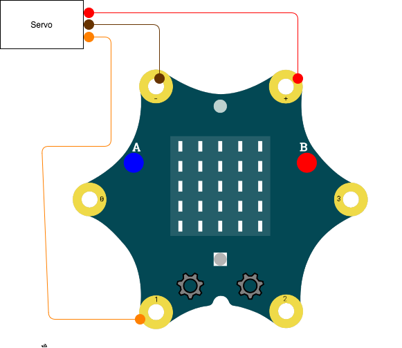

# calliopeServerTester

Diese kleine Programm kann zum Testen von Servos verwendet werden.

Bei Servos muss man unbedingt auf die benötigte Spannung achten. Reicht die angelegte Spannung nicht aus, fängt der Servo an sich sehr seltsam zu verhalten (z.B. Winken). 

Was Du benötigst:

* [PXT Editor](https://makecode.calliope.cc/)
* 5V Version
    * 1x Servo (5V Version) oder
    * 1x 5V DC Stromquelle (z.B. Steckernetzteil, oder auch 3x1,5V AA Batterien, keine Akkus!)
* 3V Version
    * 1x Servo (3V Version)
* 1x Calliope Mini Board

## Schaltplan (5V Version)

## Schaltplan (3V Version)

## Programm

## Linksammlung

* [Pinbelegung Servo Kabel](http://privat.swol.de/radolfzell/modellbaugruppe/Tips_tricks/pinbel_servo.htm)
* [Beispiel für ein 3x AA Batteriefach](https://www.reichelt.de/Batteriehalter-fuer-Mignon/HALTER-3XAA/3/index.html?ACTION=3&LA=2&ARTICLE=44631&GROUPID=4255&artnr=HALTER+3XAA&trstct=pol_15)
* [Beispiel für einen 5v Servo]()