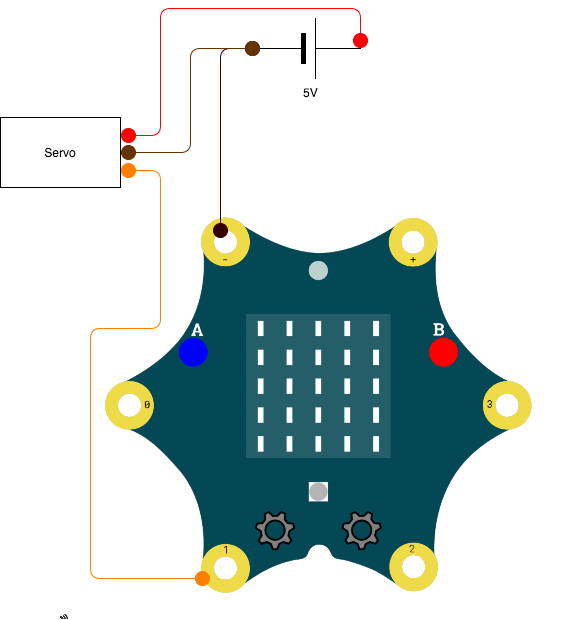
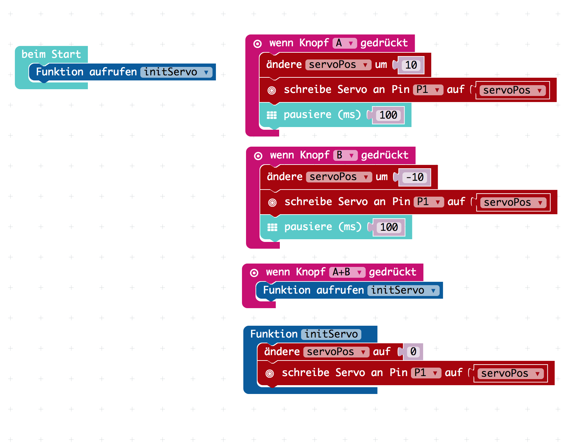

# calliopeServerTester

Diese kleine Programm kann zum Testen von Servos verwendet werden. Ich habe 

Was Du benötigst:

* [PXT Editor](https://makecode.calliope.cc/)
* 1x Servo (5V Version)
* 1x Calliope Mini Board

## Schaltplan

## Programm

## Linksammlung

* [Pinbelegung Servo Kabel](http://privat.swol.de/radolfzell/modellbaugruppe/Tips_tricks/pinbel_servo.htm)

